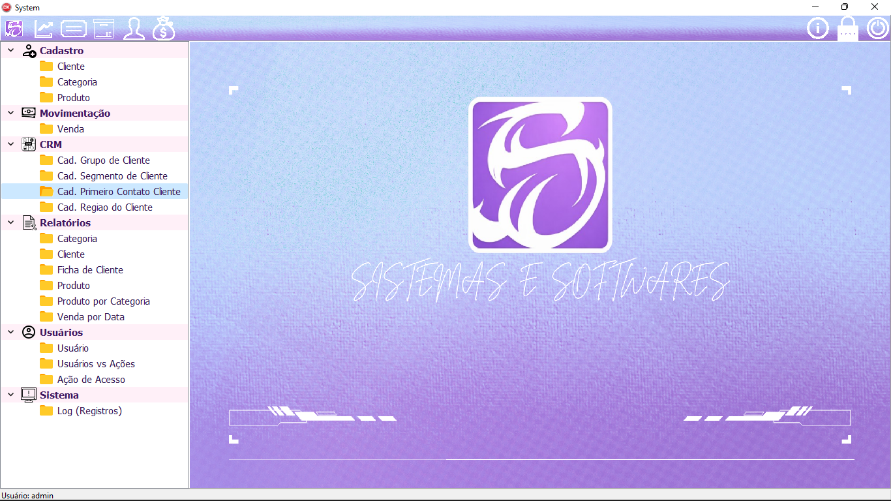
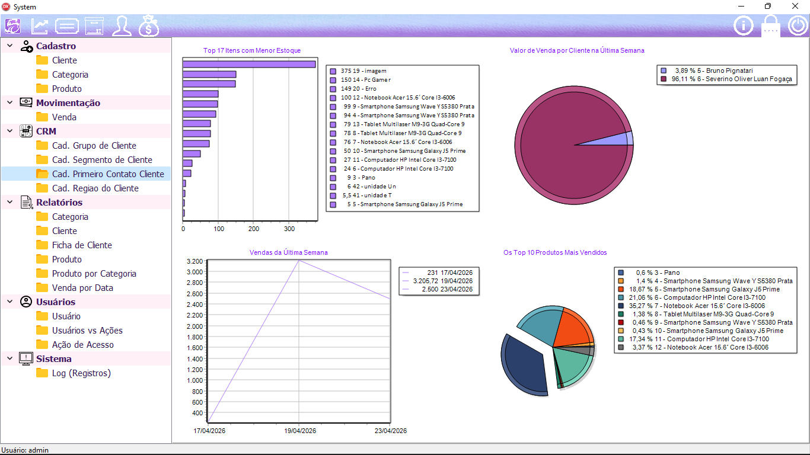

# 🛒 Sistema de Vendas — Delphi VCL + FireDAC + SQL Server



> Sistema completo de gestão comercial desenvolvido em Delphi (VCL), com arquitetura em camadas, herança visual, controle de estoque, geração de relatórios, módulo CRM e sistema de acesso por usuário com autenticação segura.

---

## 📋 Índice

1. [Visão Geral](#visão-geral)
2. [Tecnologias Utilizadas](#tecnologias-utilizadas)
3. [Arquitetura do Projeto](#arquitetura-do-projeto)
4. [Estrutura de Pastas](#estrutura-de-pastas)
5. [Módulos do Sistema](#módulos-do-sistema)
6. [Banco de Dados](#banco-de-dados)
7. [Tela Herdada (Base)](#tela-herdada-base)
8. [Autenticação e Controle de Acesso](#autenticação-e-controle-de-acesso)
9. [Segurança — Senhas com SHA-256 e Salt Individual](#segurança--senhas-com-sha-256-e-salt-individual)
10. [Módulo CRM](#módulo-crm)
11. [Módulo de Vendas](#módulo-de-vendas)
12. [Relatórios](#relatórios)
13. [Gráficos e Dashboard](#gráficos-e-dashboard)
14. [Configuração e INI File](#configuração-e-ini-file)
15. [Log do Sistema](#log-do-sistema)
16. [Como Configurar e Executar](#como-configurar-e-executar)
17. [Dependências Externas](#dependências-externas)

---

## Visão Geral

O **Sistema de Vendas** é uma aplicação desktop Windows desenvolvida em **Delphi (VCL)**, voltada para pequenas e médias empresas que necessitam gerenciar clientes, produtos, pedidos de venda, estoque e relatórios gerenciais.

### Funcionalidades Principais

- Cadastro completo de **Clientes** com status (Ativo, Bloqueado, Atenção, Inativo, Prospecto)
- **Módulo CRM** com segmentação de clientes por grupo, segmento, canal de primeiro contato e região
- Cadastro de **Produtos** com fotos, categorias e tipo de estoque
- **Pedido de Vendas** com cálculo automático e baixa de estoque
- **Relatórios** exportáveis em PDF e Excel (via FortesReport)
- **Dashboard** com gráficos de vendas, estoque e produtos mais vendidos
- **Controle de Acesso** por usuário e ações configuráveis
- **Autenticação segura** com SHA-256 e salt único por usuário
- **Log** completo de auditoria das operações
- **Observações de Clientes** com motivação de status (bloqueio, atenção etc.)
- Atualização automática da estrutura do banco de dados

---

## Tecnologias Utilizadas

| Tecnologia | Versão / Detalhe |
|---|---|
| **Delphi** | RAD Studio (compatível com XE7+) |
| **VCL** | Visual Component Library (desktop Windows) |
| **FireDAC** | Camada de acesso a dados |
| **SQL Server** | Banco de dados relacional (MSSQL) |
| **FortesReport** | Geração de relatórios (PDF, XLS, XLSX) |
| **RxLib / JvLib** | Componentes auxiliares (edição de datas, moeda etc.) |
| **ACBr** | Componentes fiscais (referenciados no `.dproj`) |
| **Boss** | Gerenciador de dependências Delphi (`modules/`) |

---

## Arquitetura do Projeto

O projeto segue uma **arquitetura em camadas** com separação clara entre:

```
┌──────────────────────────────────────────────┐
│              Camada de Apresentação           │
│  Forms VCL: Cadastros, Processos, Relatórios  │
└──────────────────┬───────────────────────────┘
                   │
┌──────────────────▼───────────────────────────┐
│              Camada de Negócio                │
│  Classes: TCategoria, TCliente, TVenda, etc.  │
└──────────────────┬───────────────────────────┘
                   │
┌──────────────────▼───────────────────────────┐
│              Camada de Dados                  │
│  FireDAC: TFDQuery, TFDConnection (MSSQL)     │
└──────────────────────────────────────────────┘
```

### Padrão de Herança Visual

Todas as telas de cadastro herdam de `TfrmTelaHeranca`, que fornece:
- Grid de listagem com pesquisa dinâmica
- Botões padrão (Novo, Alterar, Cancelar, Gravar, Apagar, Fechar)
- Navegador de registros (`TDBNavigator`)
- Abas "Listagem" e "Manutenção"
- Ordenação por clique no cabeçalho da coluna
- Persistência de layout de colunas no arquivo `.INI`

---

## Estrutura de Pastas

```
/
├── Cadastro/                  # Forms de cadastro de entidades
│   ├── uCadCategorias.pas/.dfm
│   ├── uCadCliente.pas/.dfm
│   ├── uCadProduto.pas/.dfm
│   ├── uCadUsuario.pas/.dfm
│   ├── uCadAcaoAcesso.pas/.dfm
│   ├── uCadGrupoCliente.pas/.dfm
│   ├── uCadSegmentoCliente.pas/.dfm
│   ├── uCadPrimeiroContatoCliente.pas/.dfm
│   └── uCadRegiaoCliente.pas/.dfm
│
├── classes/                   # Camada de negócio (POO)
│   ├── cCadCategoria.pas
│   ├── cCadCliente.pas
│   ├── cCadProduto.pas
│   ├── cCadUsuario.pas
│   ├── cCadGrupoCliente.pas
│   ├── cCadSegmentoCliente.pas
│   ├── cCadPrimeiroContatoCliente.pas
│   ├── cCadRegiaoCliente.pas
│   ├── cProdutoVenda.pas      # Regras de venda e estoque
│   ├── cControleEstoque.pas   # Baixa/retorno de estoque
│   ├── cUsuarioLogado.pas     # Controle de acesso por chave
│   ├── cAcaoAcesso.pas
│   ├── cArquivoIni.pas        # Leitura/escrita do INI
│   ├── cFuncao.pas            # Funções utilitárias
│   ├── cAtualizacaoBandoDeDados.pas
│   ├── cAtualizacaoTabelaMSSQL.pas
│   └── cAtualizacaoCampoMSSQL.pas
│
├── consulta/                  # Forms de consulta (lookup)
│   ├── uConCategoria.pas/.dfm
│   ├── uConClientes.pas/.dfm
│   └── uConProdutos.pas/.dfm
│
├── DataModule/                # Módulos de dados
│   ├── uDTMConexao.pas/.dfm   # Conexão principal com o banco
│   ├── uDtmVenda.pas/.dfm     # Queries e ClientDataSet de vendas
│   ├── uDtmGrafico.pas/.dfm   # Queries para gráficos/dashboard
│   └── uFrmAtualizaDB.pas     # Tela de atualização do banco
│
├── Heranca/                   # Telas base para herança
│   ├── uTelaHeranca.pas/.dfm
│   ├── uTelaHerancaConsulta.pas/.dfm
│   ├── uTelaHerancaPesquisa.pas/.dfm
│   ├── uEnum.pas              # Enumerações globais
│   └── uFuncaoCriptografia.pas  # SHA-256 + salt
│
├── Login/                     # Autenticação e acesso
│   ├── uLogin.pas/.dfm
│   ├── uAlterarSenha.pas/.dfm
│   └── uUsuarioVsAcoes.pas/.dfm
│
├── Log_Registros/             # Auditoria
│   ├── cLog.pas
│   └── uLogSistema.pas/.dfm
│
├── ObservacaoClientes/        # Observações vinculadas a status
│   └── uObservacaoClientes.pas/.dfm
│
├── processo/                  # Processo de venda
│   └── uProVenda.pas/.dfm
│
├── Relatório/                 # Relatórios gerenciais
│   ├── uRelCategoria.pas/.dfm
│   ├── uRelCliente.pas/.dfm
│   ├── uRelClienteFicha.pas/.dfm
│   ├── uRelProduto.pas/.dfm
│   ├── uRelProdutoComCategoria.pas/.dfm
│   ├── uRelProVenda.pas/.dfm
│   ├── uRelVendaPorData.pas/.dfm
│   └── uSelecionarData.pas/.dfm
│
├── Win32/Debug/
│   └── Vendas.INI             # Configurações de conexão e layout
│
├── uPrincipal.pas             # Form principal (menu)
├── Vendas.dpr                 # Arquivo principal do projeto
└── Vendas.dproj               # Arquivo de projeto MSBuild
```

---

## Módulos do Sistema

### 1. Cadastro de Categorias (`uCadCategorias`)

Gerencia as categorias de produtos.

**Campos:** `categoriasId` (PK, auto-incremento), `descricao` (até 30 chars)

**Classe de negócio:** `TCategoria` (`cCadCategoria.pas`)

**SQL principal:**
```sql
SELECT categoriasId, descricao FROM categorias
```

---

### 2. Cadastro de Clientes (`uCadCliente`)

Cadastro completo de clientes com status visual diferenciado por ícone colorido na grid. A partir da versão com CRM, a tela passou a ter três abas: **Listagem**, **Manutenção** e **CRM**.

**Campos:**
| Campo | Tipo | Detalhe |
|---|---|---|
| `clienteId` | AutoInc | Chave primária |
| `nome` | String(60) | Nome do cliente |
| `endereco` | String(60) | Endereço |
| `bairro` | String(40) | Bairro |
| `cidade` | String(50) | Cidade |
| `estado` | String(2) | UF |
| `cep` | String(10) | CEP com busca automática |
| `telefone` | String(14) | Com máscara formatada |
| `email` | String(100) | E-mail |
| `dataNascimento` | DateTime | Data de nascimento |
| `clienteStatusId` | Integer | Status (FK) |
| `pessoaTipoId` | Integer | Pessoa Física ou Jurídica |
| `cpfCnpj` | String | CPF ou CNPJ com máscara dinâmica |
| `grupoClienteId` | Integer | FK → grupoCliente (CRM) |
| `segmentoClienteId` | Integer | FK → segmentoCliente (CRM) |
| `primeiroContatoClienteId` | Integer | FK → primeiroContatoCliente (CRM) |
| `regiaoClienteId` | Integer | FK → regiaoCliente (CRM) |

**Status de Clientes:**

| ID | Status | Ícone | Comportamento na Venda |
|---|---|---|---|
| 1 | Ativo | 🟢 Verde | Venda permitida |
| 2 | Bloqueado | 🔵 Azul | Venda bloqueada + exibe observação |
| 3 | Atenção | 🔵 Azul claro | Venda com aviso + exibe observação |
| 4 | Inativo | ⚫ Cinza | Venda permitida (vira Ativo ao salvar) |
| 5 | Prospecto | 🟣 Roxo | Venda permitida (vira Ativo ao salvar) |

**Busca de CEP:** O botão de lupa ao lado do campo CEP consulta automaticamente o endereço via serviço externo, preenchendo logradouro, bairro, cidade e estado.

**Classe de negócio:** `TCliente` (`cCadCliente.pas`)

---

### 3. Cadastro de Produtos (`uCadProduto`)

Gerencia o portfólio de produtos com suporte a imagem, categoria e tipo de estoque.

**Campos:**
| Campo | Tipo | Detalhe |
|---|---|---|
| `produtoId` | AutoInc | Chave primária |
| `nome` | String(60) | Nome do produto |
| `descricao` | Memo(255) | Descrição detalhada |
| `valor` | BCD(18,5) | Preço de venda |
| `quantidade` | BCD(18,5) | Estoque atual |
| `categoriaId` | Integer | FK para categorias |
| `foto` | Blob | Imagem do produto |
| `tipoEstoqueProdutoId` | Integer | FK para tipoEstoqueProduto |

**Tipo de Estoque:** Define se o produto permite decimais e quantas casas decimais são usadas (ex: produtos vendidos por kg vs. unidade).

**Classe de negócio:** `TProduto` (`cCadProduto.pas`)

---

### 4. Cadastro de Usuários (`uCadUsuario`)

Gerencia os usuários do sistema. As senhas são armazenadas com **SHA-256 + salt individual** (ver seção [Segurança](#segurança--senhas-com-sha-256-e-salt-individual)).

**Campos:** `usuarioId`, `nome` (até 50 chars), `senha` (hash SHA-256, 64 chars), `senhaSalt` (salt aleatório, 64 chars)

---

### 5. Ação de Acesso (`uCadAcaoAcesso`)

Cadastra as ações disponíveis no sistema que podem ser liberadas ou bloqueadas por usuário.

**Campos:** `acaoAcessoId`, `descricao` (até 100 chars), `chave` (até 60 chars)

A `chave` é usada para identificar unicamente a permissão no código, no formato `NomeDaTelaOuModulo_NomeDoBotao`.

---

## Banco de Dados

### Diagrama das Principais Tabelas

```
categorias ──────────────── produtos
  categoriasId (PK)          produtoId (PK)
  descricao                  nome
                             descricao
                             valor
                             quantidade ◄── controle por TControleEstoque
                             categoriaId (FK → categorias)
                             foto (Blob)
                             tipoEstoqueProdutoId (FK → tipoEstoqueProduto)

                             ┌─ grupoCliente (CRM)
                             │    grupoClienteId (PK)
                             │    descricao
clientes ──────────────────────  statusId (FK → statusBit)
  clienteId (PK)             │
  nome                       ├─ segmentoCliente (CRM)
  endereco / cidade / ...    │    segmentoClienteId (PK)
  clienteStatusId (FK)       │    descricao
  pessoaTipoId (FK)          │    statusId (FK → statusBit)
  grupoClienteId (FK) ───────┤
  segmentoClienteId (FK) ────┤─ primeiroContatoCliente (CRM)
  primeiroContatoClienteId ──┤    primeiroContatoClienteId (PK)
  regiaoClienteId (FK) ──────┘    descricao
                                   statusId (FK → statusBit)

                              regiaoCliente (CRM)
                                regiaoClienteId (PK)
                                descricao
                                statusId (FK → statusBit)

clientes ──────── vendas ──────── vendasItens
                   vendaId (PK)    vendaId (FK)
                   clienteId (FK)  produtoId (FK)
                   dataVenda       valorUnitario
                   totalVenda      quantidade
                                   totalProduto

clienteObservacao              usuarios ──────────── usuariosAcaoAcesso
  clienteObservacaoId (PK)      usuarioId (PK)        usuarioId (FK)
  clienteId (FK)                nome                  acaoAcessoId (FK)
  tipoObservacao                senha (SHA-256)        ativo (Boolean)
  observacao                    senhaSalt (salt único)
  dataRegistro                                        acaoAcesso
                                                       acaoAcessoId (PK)
tipoEstoqueProduto              logSistema             descricao
  tipoEstoqueProdutoId (PK)      logId (PK)            chave
  descricao                      dataHora
  sigla                          usuarioId
  permiteDecimal                 usuarioNome
  casasDecimais                  tela
                                 acao
statusBit                        descricao
  statusId (PK)
  descricao
```

### Conexão com o Banco

Configurada via `uDTMConexao` usando **FireDAC** com driver MSSQL:

```ini
# Win32/Debug/Vendas.INI
[SERVER]
TipoDataBase=MSSQL
HostName=.\SERVERCURSO
Port=1433
OSAuthent=Yes
User=admin
Password=admin
Database=vendas
```

A autenticação Windows (`OSAuthent=Yes`) é suportada. Para autenticação SQL Server, definir `OSAuthent=No` e informar `User` e `Password`.

---

## Tela Herdada (Base)

`TfrmTelaHeranca` é o coração visual do sistema. Todos os formulários de cadastro e processo herdam dela.

### Comportamentos Herdados

**Pesquisa Dinâmica:**
- Detecta automaticamente o tipo do campo (`String`, `Integer`, `Float`, `DateTime`)
- Para strings: usa `LIKE :VALOR` com `%texto%`
- Para inteiros: usa `= :VALOR` com validação
- Para datas: suporta `BETWEEN :dataInicio AND :dataFim`
- O índice de pesquisa é definido pela propriedade `IndiceAtual`

**Persistência de Layout:**
- As larguras e ordem das colunas da grid são salvas no arquivo `.INI`
- Seção: `[NomeDoForm_NumeroDoMonitor_Grid]`
- Restauradas automaticamente no próximo acesso

**Grid Estilizada:**
- Linhas alternadas em cores (cinza claro / branco)
- Linha selecionada em roxo pastel (`RGB(220, 200, 255)`)
- Títulos centralizados e em branco sobre fundo cinza
- Ordenação por clique no título da coluna

**Controle de Estado:**
```delphi
TEstadoDoCadastro = (ecInserir, ecAlterar, ecNenhum)
```

**Métodos Abstratos (override obrigatório):**
```delphi
function Apagar: Boolean; virtual; abstract;
function Gravar(EstadoDoCadastro: TEstadoDoCadastro): Boolean; virtual; abstract;
function NomeCampoId: string; virtual; abstract;
function NomeCampoNome: string; virtual; abstract;
function ValorLogId: string; virtual; abstract;
function ValorLogNome: string; virtual; abstract;
```

---

## Autenticação e Controle de Acesso

### Login

O form de login (`uLogin`) solicita usuário e senha. A senha é processada com SHA-256 + salt antes de ser comparada com o banco. O objeto `oUsuarioLogado` (global) armazena os dados do usuário logado.

### Verificação de Permissão

A classe `TUsuarioLogado` possui o método estático:

```delphi
class function TenhoAcesso(
  aUsuarioId: Integer;
  aChave: string;
  aConexao: TFDConnection
): Boolean;
```

**SQL de verificação:**
```sql
SELECT usuarioId
FROM usuariosAcaoAcesso
WHERE usuarioId = :usuarioId
  AND acaoAcessoId = (
    SELECT TOP 1 acaoAcessoId FROM acaoAcesso WHERE chave = :chave
  )
  AND ativo = 1
```

### Gestão de Permissões

O form `uUsuarioVsAcoes` exibe dois grids lado a lado:
- Esquerdo: lista de usuários
- Direito: todas as ações disponíveis, marcando quais estão ativas para o usuário selecionado

Duplo clique em uma ação alterna seu estado (`ativo = 1/0`) via `UPDATE` direto com transação.

---

## Segurança — Senhas com SHA-256 e Salt Individual

A autenticação foi completamente reformulada para seguir boas práticas modernas de armazenamento de credenciais. As senhas **nunca são armazenadas em texto claro** — nem em formato reversível de qualquer tipo.

### Como funciona

Cada usuário possui um **salt único e aleatório**, gerado no momento do cadastro ou da alteração de senha. O hash final armazenado no banco é calculado concatenando o salt com a senha digitada:

```
Hash = SHA-256(salt + senha)
```

Dois usuários com a mesma senha terão hashes completamente diferentes no banco, porque cada salt é único.

### Implementação

O módulo `uFuncaoCriptografia` (em `Heranca/`) concentra toda a lógica criptográfica, usando a unit nativa `System.Hash` do Delphi — sem dependências externas:

```delphi
// Gera um salt de 16 caracteres a partir de um GUID aleatório
function GerarSalt: string;
begin
  Result := Copy(THashSHA2.GetHashString(GuidToString(TGUID.NewGuid)), 1, 16);
end;

// Gera o hash SHA-256 de (salt + senha)
function GerarHash(const Senha, Salt: string): string;
begin
  Result := THashSHA2.GetHashString(Salt + Senha);
end;
```

### Fluxo de cadastro de senha

Quando o usuário define ou altera a senha, a classe `TUsuario` executa automaticamente via `SetSenha`:

1. Gera um novo salt aleatório via `GerarSalt`
2. Calcula o hash via `GerarHash(senha, salt)`
3. Armazena **hash** e **salt** separadamente nas colunas `senha` e `senhaSalt`
4. A senha original **nunca trafega nem é persistida**

### Fluxo de login

No método `TUsuario.Logar`:

1. Busca o registro pelo nome do usuário
2. Recupera o `senhaSalt` armazenado
3. Recalcula o hash: `GerarHash(senhaDigitada, saltBanco)`
4. Compara o resultado com o `senha` armazenado
5. Acesso concedido somente se os hashes forem idênticos

```delphi
HashDigitado := GerarHash(aSenha, Qry.FieldByName('senhaSalt').AsString);
if HashDigitado = Qry.FieldByName('senha').AsString then
  Result := True; // login bem-sucedido
```

### Estrutura da tabela `usuarios`

```sql
CREATE TABLE usuarios (
  usuarioId  int IDENTITY(1,1) NOT NULL PRIMARY KEY,
  nome       varchar(50) NOT NULL,
  senha      varchar(64) NOT NULL,   -- hash SHA-256 (64 hex chars)
  senhaSalt  varchar(64) NOT NULL    -- salt aleatório único por usuário
)
```

### Por que isso importa

| Abordagem | Vulnerabilidade |
|---|---|
| Texto puro | Qualquer acesso ao banco expõe todas as senhas imediatamente |
| MD5/SHA-1 sem salt | Rainbow tables e ataques de dicionário funcionam em segundos |
| **SHA-256 + salt único** | Cada hash só pode ser atacado individualmente; rainbow tables são completamente ineficazes |

### Observações de migração

Ao atualizar um banco existente sem a coluna `senhaSalt`, o script `TAtualizacaoCampoMSSQL.Versao1` a adiciona automaticamente:

```sql
ALTER TABLE usuarios ADD senhaSalt varchar(64)
```

Usuários com `senhaSalt` nulo terão erro de autenticação até que suas senhas sejam redefinidas pelo administrador — comportamento esperado e seguro, pois impede que contas com senhas em formato antigo sigam funcionando sem atualização.

---

## Módulo CRM

O sistema conta com um módulo de CRM (Customer Relationship Management) que enriquece o cadastro de clientes com dados de segmentação e origem. Todas as tabelas do CRM possuem campo `statusId` vinculado à tabela `statusBit` (Ativo/Inativo), permitindo desativar registros sem excluí-los.

### Tabelas do CRM

| Tabela | Descrição | Campos principais |
|---|---|---|
| `grupoCliente` | Agrupamento comercial do cliente (ex: Atacado, Varejo) | `grupoClienteId`, `descricao`, `statusId` |
| `segmentoCliente` | Segmento de mercado do cliente (ex: Tecnologia, Agro) | `segmentoClienteId`, `descricao`, `statusId` |
| `primeiroContatoCliente` | Canal pelo qual o cliente chegou (ex: Indicação, Site, Redes Sociais) | `primeiroContatoClienteId`, `descricao`, `statusId` |
| `regiaoCliente` | Região geográfica de atuação do cliente | `regiaoClienteId`, `descricao`, `statusId` |

### Vínculo com o Cadastro de Clientes

A tabela `clientes` foi ampliada com quatro novas colunas opcionais que referenciam as tabelas do CRM:

```sql
ALTER TABLE clientes ADD grupoClienteId           int NULL  -- FK → grupoCliente
ALTER TABLE clientes ADD segmentoClienteId        int NULL  -- FK → segmentoCliente
ALTER TABLE clientes ADD primeiroContatoClienteId int NULL  -- FK → primeiroContatoCliente
ALTER TABLE clientes ADD regiaoClienteId          int NULL  -- FK → regiaoCliente
```

Todas as FKs são adicionadas de forma idempotente via `IF NOT EXISTS` no script de atualização automática (`TAtualizacaoTableMSSQL`), garantindo que bancos pré-existentes sejam migrados sem erros.

### Tela de Cadastro de Clientes — Aba CRM

A tela `uCadCliente` ganhou uma terceira aba chamada **CRM** com quatro `TDBLookupComboBox`, um para cada tabela do módulo. As queries de lookup filtram apenas registros ativos (`WHERE statusId = 1`), evitando que opções desativadas apareçam na seleção.

### Telas de Manutenção do CRM

Cada entidade do CRM possui seu próprio formulário de cadastro, todos acessíveis pelo menu lateral na seção **CRM**:

| Tela | Formulário | Acesso no menu |
|---|---|---|
| Grupo de Cliente | `TfrmCadGrupoCliente` | CRM → Cad. Grupo de Cliente |
| Segmento de Cliente | `TfrmCadSegmentoCliente` | CRM → Cad. Segmento de Cliente |
| Primeiro Contato | `TfrmCadPrimeiroContato` | CRM → Cad. Primeiro Contato Cliente |
| Região do Cliente | `TfrmCadRegiaoCliente` | CRM → Cad. Regiao do Cliente |

Todos herdam de `TfrmTelaHeranca` e seguem o mesmo padrão visual e de comportamento das demais telas de cadastro do sistema, incluindo pesquisa dinâmica, persistência de layout de colunas e log de auditoria. O campo **Status** em cada formulário usa um `TDBLookupComboBox` apontando para a tabela `statusBit`, permitindo ativar ou inativar qualquer opção sem excluí-la.

### Atualização automática do banco para o CRM

O script `TAtualizacaoTableMSSQL` cria as tabelas do CRM na ordem correta de dependência:

1. `statusBit` (tabela de domínio, sem FKs)
2. `grupoCliente`, `segmentoCliente`, `primeiroContatoCliente`, `regiaoCliente` (FK → statusBit)
3. `clientes` (FK → todas as tabelas acima)

Se o banco já existir, as colunas e FKs de CRM na tabela `clientes` são adicionadas via `ALTER TABLE` condicional, sem risco de duplicação.

---

## Módulo de Vendas

O processo de venda (`uProVenda`) é o módulo mais complexo do sistema, herdando de `TfrmTelaHeranca`.

### Fluxo de uma Venda

```
1. Selecionar Cliente
       │
       ▼
2. Validar Status do Cliente
   ├── Ativo (1)     → Prossegue
   ├── Bloqueado (2) → BLOQUEADO + exibe observação
   ├── Atenção (3)   → Aviso + prossegue
   ├── Inativo (4)   → Prossegue (vira Ativo ao salvar)
   └── Prospecto (5) → Prossegue (vira Ativo ao salvar)
       │
       ▼
3. Informar Data da Venda
       │
       ▼
4. Adicionar Produtos ao TClientDataSet
   ├── Selecionar produto (lookup ou consulta)
   ├── Definir valor unitário (pré-preenchido)
   ├── Definir quantidade (respeita tipo de estoque: inteiro/decimal)
   ├── Validação: quantidade > estoque → alerta com opção de continuar
   └── Calcular total do produto
       │
       ▼
5. Totalizar Venda (soma de todos os itens)
       │
       ▼
6. Gravar
   ├── INSERT em vendas (OUTPUT inserted.vendaId)
   ├── INSERT em vendasItens (para cada item)
   ├── BaixarEstoque (UPDATE produtos SET quantidade -= :qtde)
   ├── Se cliente era Inativo/Prospecto → UPDATE clienteStatusId = 1
   └── Gerar e exibir relatório da venda (PreviewModal)
```

### Arquitetura de Dados da Venda

```
TdtmVenda (DataModule)
├── QryCliente     → SELECT clienteId, nome, clienteStatusId FROM clientes
├── QryProdutos    → SELECT produtoId, nome, valor, quantidade, foto FROM produtos
├── QryTipoEstoque → SELECT tipoEstoqueProdutoId, permiteDecimal, casasDecimais FROM tipoEstoqueProduto
├── cdsItensVenda  → TClientDataSet in-memory
│   ├── produtoId
│   ├── nomeProduto
│   ├── quantidade
│   ├── valorUnitario
│   └── valorTotalProduto
└── OnItemVendaChange → evento para atualizar imagem do produto
```

### Controle de Estoque

A classe `TControleEstoque` gerencia a movimentação de estoque:

```delphi
// Baixa de estoque (ao incluir/alterar item)
UPDATE produtos SET quantidade = quantidade - :qtdeBaixa WHERE produtoId = :produtoId

// Retorno de estoque (ao excluir/alterar item)
UPDATE produtos SET quantidade = quantidade + :qtdeRetorno WHERE produtoId = :produtoId
```

Todas as operações são encapsuladas em transações (`StartTransaction / Commit / Rollback`).

### Observações de Clientes

O form `uObservacaoClientes` permite registrar observações textuais vinculadas a um cliente. O campo `tipoObservacao` (valores 2 e 3) indica observações relacionadas a status de bloqueio/atenção, que são exibidas automaticamente ao tentar vender para clientes nesses status.

---

## Relatórios

Todos os relatórios utilizam o componente **FortesReport** e suportam exportação para:
- 📄 **PDF** (`TRLPDFFilter`)
- 📊 **Excel XLS** (`TRLXLSFilter`)
- 📊 **Excel XLSX** (`TRLXLSXFilter`)

| Relatório | Classe | Descrição |
|---|---|---|
| Categorias | `TfrmRelCategoria` | Listagem de todas as categorias |
| Clientes | `TfrmRelCliente` | Listagem de clientes (nome, e-mail, telefone) |
| Ficha do Cliente | `TfrmRelClienteFicha` | Ficha completa com todos os dados do cliente |
| Produtos | `TfrmRelProduto` | Listagem de produtos com valor e quantidade |
| Produtos por Categoria | `TfrmRelProdutoComCategoria` | Agrupado por categoria com totais |
| Vendas | `TfrmRelProVenda` | Detalhe de venda(s) com itens e totais |
| Vendas por Data | `TfrmRelVendaPorData` | Vendas filtradas por intervalo de datas |

### Seleção de Período

O form `uSelecionarData` é um diálogo reutilizável para escolha de período. Ao abrir, inicializa automaticamente com o primeiro e último dia do mês atual (`StartOfTheMonth` / `EndOfTheMonth`).

---

## Gráficos e Dashboard



O DataModule `TdtmGrafico` contém as queries pré-configuradas para alimentar os gráficos:

### Queries Disponíveis

**Estoque de Produtos (Top 17, ordem crescente):**
```sql
SELECT TOP 17
  CONVERT(VARCHAR, produtoId) + ' - ' + nome AS Label,
  quantidade AS Value
FROM produtos
ORDER BY quantidade ASC
```

**Valor de Venda por Cliente (últimos 7 dias):**
```sql
SELECT CONVERT(VARCHAR, vendas.clienteId) + ' - ' + clientes.nome AS Label,
       SUM(vendas.totalVenda) AS Value
FROM Vendas
INNER JOIN clientes ON clientes.clienteId = vendas.clienteId
WHERE vendas.dataVenda BETWEEN CONVERT(DATE, GETDATE()-7) AND CONVERT(DATE, GETDATE())
GROUP BY Vendas.clienteId, clientes.Nome
```

**Produtos Mais Vendidos (Top 10):**
```sql
SELECT TOP 10
  CONVERT(VARCHAR, vi.produtoId) + ' - ' + p.nome AS Label,
  SUM(vi.totalProduto) AS Value
FROM vendasItens AS vi
INNER JOIN produtos AS p ON p.produtoId = vi.produtoId
GROUP BY vi.produtoId, p.nome
```

**Vendas na Última Semana:**
```sql
SELECT vendas.dataVenda AS Label, SUM(vendas.totalvenda) AS Value
FROM vendas
WHERE vendas.dataVenda BETWEEN CONVERT(DATE, GETDATE()-7) AND CONVERT(DATE, GETDATE())
GROUP BY vendas.dataVenda
```

---

## Configuração e INI File

O arquivo `Vendas.INI` (gerado automaticamente na pasta do executável) armazena:

### Seção `[SERVER]`

```ini
[SERVER]
TipoDataBase=MSSQL
HostName=.\SERVERCURSO
Port=1433
OSAuthent=Yes
User=admin
Password=admin
Database=vendas
```

### Seções de Layout da Grid

Para cada form com grid, o layout das colunas é persistido no formato:

```ini
[NomeForm_NroMonitor_Grid]
Col_0_Width=74
Col_0_Order=0
Col_0_Field=nomeDoField
Col_1_Width=305
...
```

A classe `TArquivoIni` abstrai toda leitura e escrita no INI:

```delphi
TArquivoIni.LerIni('SERVER', 'HostName');
TArquivoIni.AtualizarIni('SERVER', 'HostName', 'novo.servidor');
```

---

## Log do Sistema

O módulo de log (`Log_Registros/cLog.pas` + `uLogSistema`) registra todas as operações de CRUD realizadas no sistema.

### Estrutura da Tabela `logSistema`

```sql
logId        -- AutoInc, PK
dataHora     -- DateTime do evento
usuarioId    -- ID do usuário que realizou a ação
usuarioNome  -- Nome snapshot do usuário
tela         -- Nome do formulário
acao         -- Ação realizada (Inserir, Alterar, Apagar etc.)
descricao    -- Detalhes (ex: "ID: 42 - Nome: Produto X")
```

O form `uLogSistema` herda de `TfrmTelaHeranca` e exibe o log com filtro por intervalo de datas.

---

## Atualização do Banco de Dados

O sistema possui um mecanismo de atualização automática da estrutura do banco de dados via:

- `TAtualizaBancoDeDados` — orquestra o processo de atualização
- `TAtualizacaoTableMSSQL` — cria/verifica tabelas no SQL Server (incluindo tabelas do CRM)
- `TAtualizacaoCampoMSSQL` — adiciona/verifica campos nas tabelas (incluindo `senhaSalt`)

Isso permite que novas versões do sistema atualizem o schema do banco sem intervenção manual.

---

## Como Configurar e Executar

### Pré-requisitos

- Delphi RAD Studio (versão compatível com `ProjectVersion 18.4`)
- SQL Server (local ou rede) com banco `vendas` criado
- Pacotes FortesReport instalados no IDE
- Pacotes RxLib / JvLib instalados no IDE

### Passo a Passo

1. **Clonar o repositório** e abrir `Vendas.dproj` no Delphi

2. **Configurar a conexão** editando `Win32/Debug/Vendas.INI`:
   ```ini
   [SERVER]
   TipoDataBase=MSSQL
   HostName=SEU_SERVIDOR\INSTANCIA
   Port=1433
   OSAuthent=No
   User=sa
   Password=SuaSenha
   Database=vendas
   ```

3. **Criar o banco de dados** `vendas` no SQL Server — o sistema cria todas as tabelas automaticamente na primeira execução

4. **Compilar** o projeto (`Ctrl+F9` ou `Project > Build`)

5. **Executar** (`F9`) — o sistema cria as tabelas, insere o usuário `admin` com senha `admin` e exibe a tela de login

### Usuário Padrão

O sistema cria automaticamente o usuário `admin` na primeira execução via `TAtualizacaoTableMSSQL.Usuario`. A senha é armazenada com SHA-256 + salt, portanto não há como recuperá-la manualmente — apenas redefinindo via tela de alteração de senha ou recriando o registro.

---

## Dependências Externas

| Dependência | Finalidade | Onde é usada |
|---|---|---|
| **FortesReport** | Geração de relatórios | `Relatório/` — todos os forms |
| **RxLib** (RxCurrEdit, RxToolEdit, RxGIF) | Campos de moeda, datas e GIF animado | `processo/`, `DataModule/`, `Relatório/` |
| **JvLib** | Componentes complementares | Referenciado no `.dproj` |
| **ACBr** | Componentes fiscais brasileiros | Referenciado no `.dproj` |
| **Boss** | Gerenciador de pacotes Delphi | Pasta `modules/` (ignorada pelo `.gitignore`) |

---

### Boas Práticas Adotadas
- Uso de `try/finally` para garantir liberação de objetos (`FreeAndNil`)
- Transações explícitas (`StartTransaction / Commit / Rollback`) em todas as operações de escrita
- Separação de responsabilidades entre classes de negócio e formulários VCL
- Persistência de layout de grid melhora a usabilidade entre sessões
- Senhas com SHA-256 + salt individual — sem texto claro nem formatos reversíveis
- Atualização automática de schema — nenhuma intervenção manual necessária em migrações

### Pontos de Melhoria Sugeridos
- Centralizar strings de SQL em constantes ou arquivos de recurso
- Adicionar testes unitários para as classes de negócio
- Considerar migração para REST API para possibilitar acesso mobile
- Adicionar relatórios com filtros por campos do CRM (grupo, segmento, região)

---

## Licença

Este projeto é de uso educacional/interno. Consulte o responsável pelo repositório para informações sobre licenciamento e redistribuição.

---

*Documentação gerada com base na análise do código-fonte do projeto `Vendas.dproj` — Sistema de Gestão Comercial em Delphi VCL.*